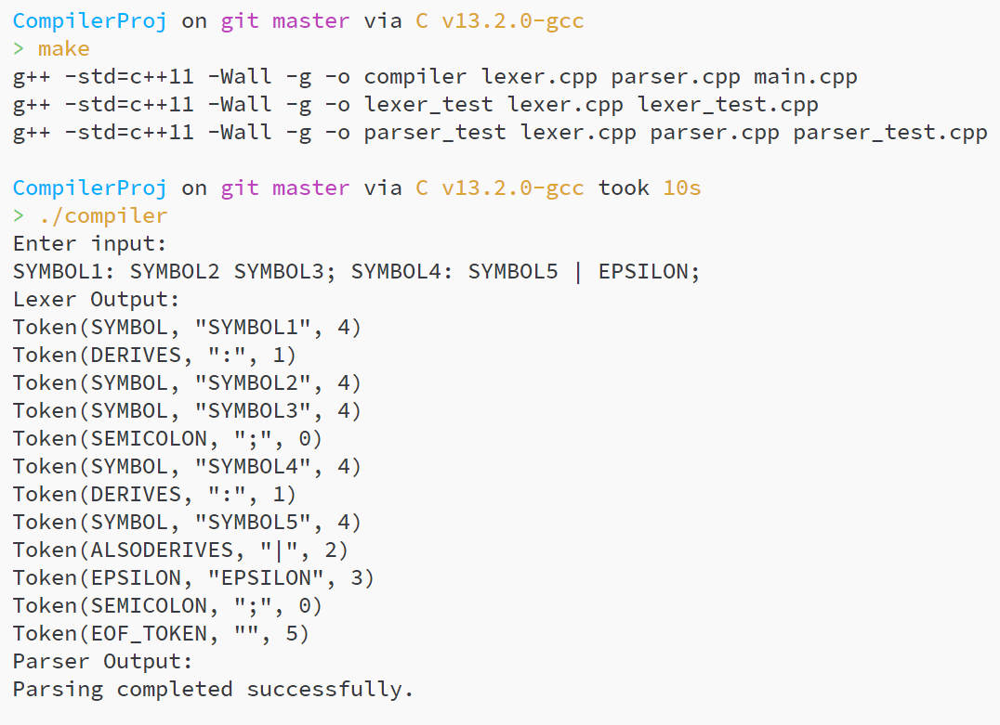
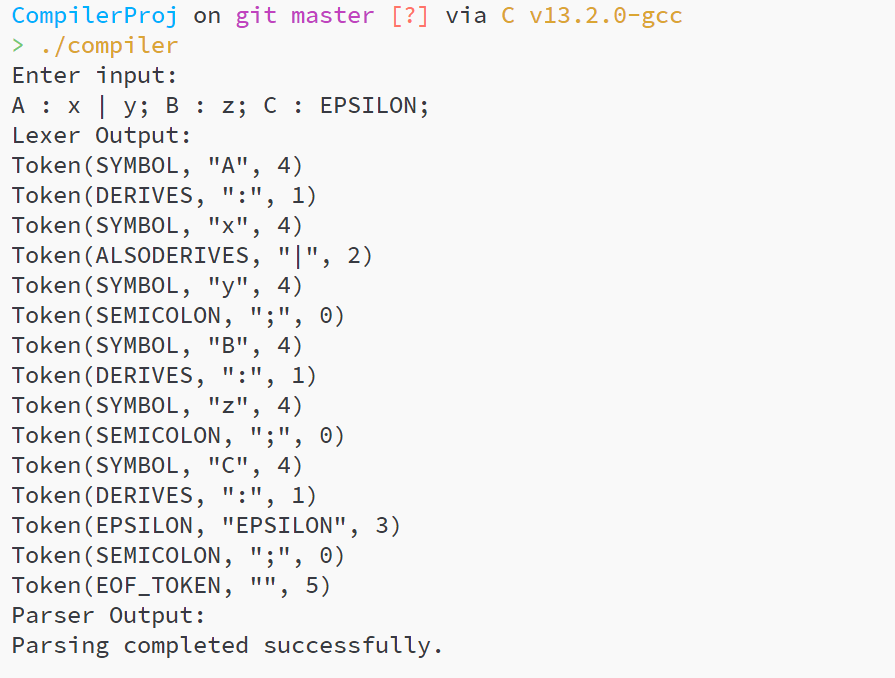
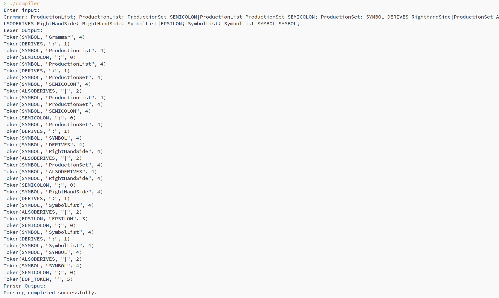

# 2024年秋 编译原理课设

## 第一次提交内容

- 词法分析器
- 递归下降语法分析器

### 运行说明

1. 在项目目录下运行 make
2. 运行编译器程序 `./compiler`，该程序是编译器的命令行程序。可以在命令行输入编译内容，按回车即进行词法分析和语法分析并分别打印结果。

### 其他运行说明

1. 运行词法分析测试程序 `./lexer_test`，该程序会读取文件lexer_test.txt的测试用例（每一行是一个测试用例），然后进行词法分析并打印输出token流，如果遇到无法识别的字符会直接退出并打印错误信息
2. 运行语法分析测试程序 `./parser_test`，该程序会读取文件parser_test.txt的内容，整个文件内容作为测试内容，程序会依次进行词法分析和语法分析并分别打印出结果。如果词法分析失败，语法分析不会进行。遇到错误会直接退出程序。
3. 运行文法左递归消除程序，该程序会处理给定的mbnf文法并尝试消除左递归，并打印结果。可以看到能良好消除直接左递归，对于间接左递归未做测试。在Utils目录下编译：`g++ -o proc_mbnf proc_mbnf.cpp` 运行：`./proc_mbnf`。

### 运行示例

